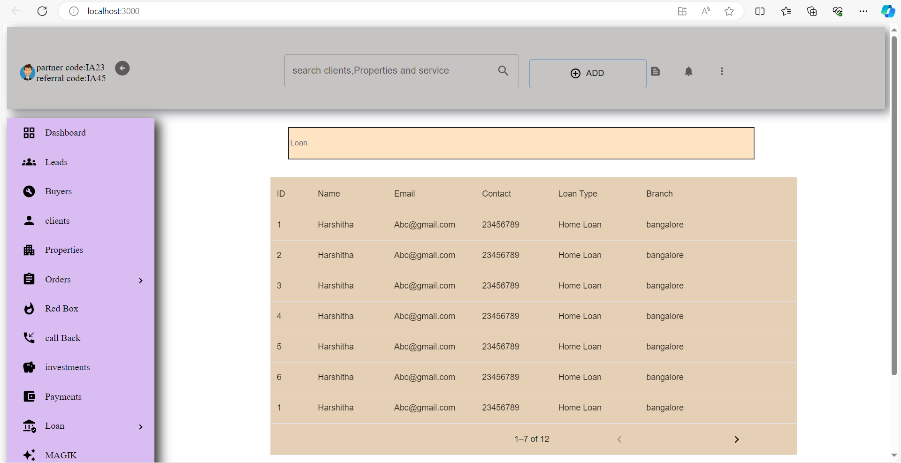

# Indiassetz Assignment

This project is the output to the requirement of Indiassetz role. It includes the required files to build project locally.

Below are the steps to follow:

## Clone the repository to local system
### `git clone https://github.com/HarshithaDixit/Indiassetz.git`

## After cloning go to the downloaded directory
### `cd Indiassetz`

## Run the below command to install all required dependency packages
### `npm install`

## Start the project using below command:
### `npm start`

## Sample Output

